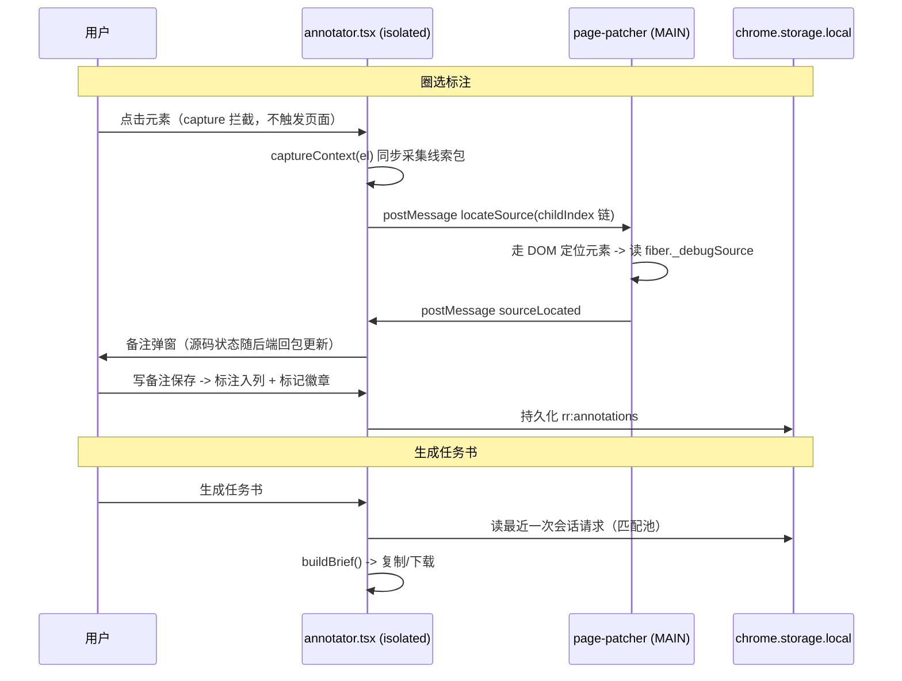

# 页面标注 领域知识库

## §0 目录索引

| § | 标题 | 定位 |
|---|------|------|
| §1 | 业务背景与核心概念 | 首次接触该域时读 |
| §2 | 架构概览 | 双 world 分工与时序 |
| §3 | 代码入口索引 | 按任务场景找入口 |
| §4 | 存储与字段入口索引 | 改存储 key/数据结构时 |
| §5 | 消息协议入口索引 | 改消息类型/通信方式时 |
| §6 | 核心业务规则与隐性约束 | 改代码前必扫的 AI 易错点 |
| §7 | 验证路径 | 改完后如何验证正确性 |
| §8 | 关联文档 | 跨域联读指引 |
| §9 | 路线图与边界 | 后续规划（MCP/ACP 派单） |

## §1 业务背景与核心概念

页面标注是扩展面向 AI Coding Agent 的第二能力（第一个是请求录制导出）：用户在浏览器里圈选页面元素、写备注、连续标注多处，然后一键生成结构化的「AI 修复任务书」（Markdown），复制或下载后交给任何 Coding Agent 修代码。

核心概念：
- **标注模式**（Annotator）：悬浮 ✎ 按钮或弹窗入口（Alt+A）唤起的整套装页 UI——圈选、备注、标记、面板、任务书
- **圈选**（picking）：光标变十字、悬停高亮、点击截获元素（不触发页面自身行为）
- **元素线索包**（ElementContext）：标注时采集的全套定位线索，是任务书的核心资产
- **语义路径**（ancestorLabels）：从外到内的语义容器标签（如「系统设置 - 基础配置」），与录制域触发溯源同一套口径
- **源码定位**（reactSource）：React 开发模式下经 fiber `_debugSource` 读到的 `文件:行号`；生产构建/非 React 页面为空，此时任务书靠线索包反查
- **任务书**（brief）：按标注批量生成的 Markdown，含定位线索、可选 HTML/样式/相关请求、本地代码目录
- **相关请求匹配**：用录制域落盘的 `triggerInfo`（触发来源描述）与标注的元素名/语义路径做包含匹配，把「这个按钮的接口 500 了」证据附进任务书
- **站点代码目录映射**（workspace-map）：host → 本地代码目录，按站点记忆，写进任务书头部供 agent 定位仓库

## §2 架构概览

**为什么源码定位要跨 world**：React 把 fiber 挂在 DOM 元素的 expando 属性上（`__reactFiber$`），isolated world 与页面 world 的 JS 属性袋隔离、读不到；但两边共享同一棵 DOM。所以 isolated 侧算出「从 documentElement 起的 childIndex 链」发给 MAIN world 的 page-patcher 代读，两边定位到的是同一批节点。

## §3 代码入口索引

| 场景 | 入口 | 说明 |
|------|------|------|
| 标注模式主入口 | `src/contents/annotator.tsx` | Plasmo CSUI（Shadow DOM 自包含 CSS，不依赖 Tailwind）；悬浮按钮/圈选/标记/面板/弹窗编排 |
| 元素线索采集 | `src/contents/annotateContext.ts` | describeElement、语义容器、选择器/DOM 路径、关键样式、源码定位 RPC |
| React 源码定位 RPC | `src/contents/page-patcher.ts` 末段 | locateSource / sourceLocated，沿 fiber 向上找带 `_debugSource` 的节点，优先有组件名的 |
| 任务书生成 | `src/lib/brief.ts` | buildBrief + matchesAnnotation（相关请求匹配的唯一权威源） |
| 标注类型与存储 | `src/lib/annotations.ts` | ElementAnnotation/ElementContext、容量清理、站点目录映射 |
| 备注/面板/任务书 UI | `src/components/annotate/*` | NotePopup、AnnotationPanel、BriefModal |
| 弹窗入口 | `src/popup.tsx` toggleAnnotate | TOGGLE_ANNOTATE 消息；**先送达再关窗** |

## §4 存储与字段入口索引

| Storage Key | 数据类型 | 业务语义 | 改动注意 |
|-------------|----------|----------|----------|
| `rr:annotations` | `ElementAnnotation[]`（扁平） | 全站标注，按 origin+pathname 分页 | 单页上限 50、全局上限 30 页；初始加载完成前禁止写回（否则空状态覆盖已有数据） |
| `rr:workspace-map` | `Record<host, dir>` | 站点 → 本地代码目录 | 空串删除条目 |

### ElementContext 关键字段

| 字段 | 说明 |
|------|------|
| elementName | 人类可读名，如 `button '保存设置'` |
| ancestorLabels | 语义容器路径（外→内，最多 3 层） |
| selector / domPath | CSS 选择器（最多 6 层）/ childIndex DOM 路径 |
| classes | 已剔除 CSS Modules/styled-components hash 的类名 |
| computedStyles | 关键样式子集（颜色/字体/间距/边框） |
| reactSource | 仅 React dev 模式可得；生产为 null 是**正常降级**不是缺陷 |
| outerHTML | 截断 1500 字符 |

## §5 消息协议入口索引

| 消息 | 通道 | 方向 | 说明 |
|------|------|------|------|
| `TOGGLE_ANNOTATE` | chrome.tabs.sendMessage | popup → 标注内容脚本 | 开关面板；监听方回 `{ok:true}` |
| `locateSource` | window.postMessage（source=`rr-annotate`） | isolated → MAIN | 携带 childIndex 链 |
| `sourceLocated` | window.postMessage（source=`rr-page`） | MAIN → isolated | `{fileName,lineNumber,componentName} \| null` |

## §6 核心业务规则与隐性约束

- **【禁止】圈选态的 click 拦截漏判自家 UI** → 拦截前必须用 `e.composedPath()` 判断事件是否来自标注 UI 的 shadow host，否则面板/弹窗按钮全被吞
- **【隐性依赖】跨 world 定位靠 childIndex 链** → 两边共享 DOM 但属性袋隔离；改 childIndexPath/buildDomPath 时必须两侧同步（annotator 侧算链、page-patcher 侧走链）
- **【AI 易错点】标注持久化必须等初始加载完成** → annotator 的写回 effect 有 `loadedRef` 守卫；删掉它会在挂载瞬间用空数组覆盖已有标注
- **【隐性依赖】标记徽章的元素引用分两级** → 新建标注存直接引用（elementMap），刷新恢复按 selector 反查（歧义时按 tagName 兜底，仍歧义则不显示徽章但标注保留）；引用失联（isConnected=false）时重查
- **【消歧】`源码定位为空` ≠ 故障** → 生产构建/非 React 页面天然拿不到 `_debugSource`，任务书此时靠线索包兜底，文案不要把空值报成错误
- **【隐性约束】popup 的 toggleAnnotate 必须先送达消息再 window.close()** → 关窗在 sendMessage 回调里；否则消息可能没发出去窗口先没了
- **【AI 易错点】样式隔离** → 标注 UI 全部走 annotator.tsx 的 `getStyle` 注入 Shadow DOM 自包含 CSS，**禁止**引用 Tailwind class（弹窗/历史页体系与页面内悬浮体系是两套，见 AGENTS.md）
- **【隐性约束】备注弹窗钳制** → y 坐标钳制 `innerHeight - 280`；改动弹窗高度时同步调这个余量，否则靠下元素弹窗会越界（E2E 踩过）
- **【AI 易错点】面板会盖住悬浮按钮** → 面板 fixed 右侧通栏，悬浮 ✎ 按钮在其下方区域内；自动化断言或用户操作时先 Esc 关面板再点悬浮按钮

## §7 验证路径

- 完整 E2E（29 项断言）：`/tmp/rr-e2e/annotate.e2e.mjs`（Playwright + Chrome for Testing，加载 `build/chrome-mv3-prod`；测试页 `/tmp/rr-e2e/testpage.html` 含伪造 fiber 与 500 接口）。脚本在临时目录，会话后可能清理；重建时按断言清单复原：入口渲染/圈选高亮/备注保存/标记徽章/源码定位/任务书内容（标题、目录映射、语义路径、源码、hash 类名剔除）/相关请求匹配/刷新持久化/TOGGLE 消息/定位闪烁
- 手动路径：加载开发目录 → 打开任意页面 → Alt+A 或 ✎ 按钮 → 圈选元素 → 写备注保存 → 生成任务书 → 复制
- 编译验证：`npm run build`（🟢 DONE）+ `npm run typecheck`

## §8 关联文档

- `docs/REQUEST_RECORDING_KNOWLEDGE_BASE.md`：相关请求匹配依赖录制域的 triggerInfo（触发溯源）；语义路径提取与 page-patcher 的触发溯源共用口径但**各自实现**（page-patcher 是 MAIN world 入口，直接 import 会连带执行 fetch/XHR 补丁）
- `docs/REQUEST_EXPORT_KNOWLEDGE_BASE.md`：另一条「打包上下文给 agent」的路径

## §9 路线图与边界

第一刀（本版）：标注 + 任务书生成（复制/下载），不含任何 agent 调用。后续：
1. MCP 方式：agent 主动来取标注 + 修完回写销单（参考 ui-ticket-mcp 生命周期模型）
2. ACP/无头派单：扩展直接调起 Cursor/OpenCode 等（ACP 知识库：本机 Cursor/OpenCode 原生 ACP 已验证；第一版用新开会话，勿依赖会话恢复）
3. 修后验证：agent 开浏览器截图对比（Chrome DevTools for agents 方向）
4. 截图进任务书（chrome.tabs.captureVisibleTab + 元素区域裁剪）

已知边界：
- 圈选点的是最顶层元素，没有「向上钻取容器」能力（同类工具第一版也没有）
- 任务书为纯文本，截图未进
- 界面文案仅中文；公开渠道分发前需按多语言规范补英文兜底（整个扩展的历史遗留）

<!-- 该文档整理于 2026-08-17；定位：AI 修改页面标注/任务书逻辑前的快速参考 -->
