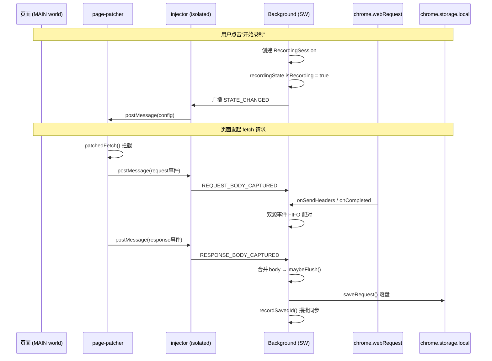
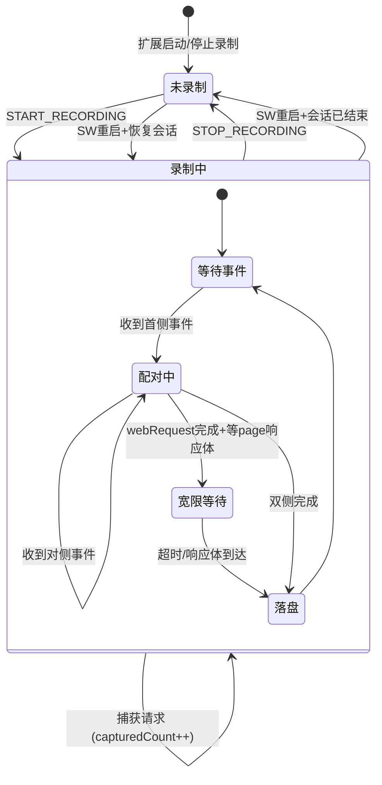

# 请求录制 领域知识库

## §0 目录索引

| § | 标题 | 定位 |
|---|------|------|
| §1 | 业务背景与核心概念 | 首次接触该域时读 |
| §1.5 | 架构概览 | 快速建立分层认知（时序图） |
| §2 | 核心业务流程/状态机 | 理解录制生命周期和事件配对 |
| §2.5 | 物理路径速查 | 直接定位代码目录 |
| §3 | 代码入口索引 | 按任务场景找入口 |
| §4 | 存储与字段入口索引 | 改存储 key/数据结构时 |
| §5 | 消息协议入口索引 | 改消息类型/通信方式时 |
| §6 | 核心业务规则与隐性约束 | 改代码前必扫的 AI 易错点 |
| §7 | 验证路径 | 改完后如何验证正确性 |
| §8 | 关联文档 | 跨域联读指引 |
| §9 | 覆盖度与待补充项 | 了解文档置信度和缺口 |

## §1 业务背景与核心概念

Request Recorder 是一个 Chrome 扩展，用于录制浏览器中发出的 HTTP 请求。核心能力是将页面中 XHR/fetch 请求的完整信息（URL、方法、请求头、请求体、响应状态、响应头、响应体、耗时）捕获并持久化，供用户以多种格式导出。

核心概念：
- **录制**（RecordingState）：扩展的运行时状态，包含"是否录制中"标志、当前会话 ID、已捕获请求数
- **会话**（RecordingSession）：一次"开始→停止"的录制区间，包含起止时间、所属页面 URL、过滤配置快照和请求 ID 列表
- **请求条目**（RecordedRequest / PendingEntry）：一条 HTTP 请求的完整记录，包括请求/响应的 headers、body、耗时、触发来源等
- **待配对条目**（PendingEntry）：尚未完成双源事件合并的中间态请求，在内存中维护，flush 后转为 RecordedRequest
- **页面补丁**（page-patcher）：注入到页面 MAIN world 的脚本，拦截 XHR/fetch 以捕获请求体和响应体
- **注入器**（injector）：运行在 isolated world 的内容脚本，桥接 page-patcher 与 Background 之间的通信

## §1.5 架构概览

## §2 核心业务流程/状态机

### 录制生命周期

1. **开始录制**（`START_RECORDING`）：创建新 RecordingSession（ID=`generateId()`，name 取页面 hostname 或时间戳），写入 storage，设置 `recordingState.isRecording=true`，广播状态变更
2. **录制中**：webRequest 和 page-patcher 双源事件不断涌入，通过 FIFO 队列配对，完成后 flush 到 storage
3. **停止录制**（`STOP_RECORDING`）：补写 session.endTime，重置 recordingState，同步缓冲区 requestIds，广播状态变更

### 双源事件配对机制

webRequest API 和 page-patcher 各自独立上报事件，配对规则：

| 事件来源 | 标识 | 配对方式 |
|---------|------|---------|
| page 响应事件 | `pageRequestId` | 精确匹配（同请求的请求/响应事件共享 ID） |
| page 请求事件 / webRequest 事件 | `tabId:url:method` | FIFO 队列认领 |

并发同 URL 请求（轮询场景）各自独立成条目，不会互相覆盖。

### PendingEntry 生命周期

1. **创建**：首侧事件到达时 `createEntry()`，加入 `allEntries` 和 `matchQueues`
2. **配对**：对侧事件到达时通过 FIFO 或 pageRequestId 匹配
3. **flush 判定**（`maybeFlush()`）：
   - webRequest 未完成 → 等待
   - 需要 page body 且 page 未完成 → 启动宽限定时器（`PAGE_GRACE_MS=1500ms`）
   - 宽限超时 → 放弃等待 page body，直接落盘
   - 双侧完成 → 立即落盘
4. **兜底清扫**：chrome.alarms 每 30s 检查，超时 `ENTRY_TTL_MS=60s` 的 entry 强制收尾

### 过滤两阶段

1. **准入**（webRequest 侧）：`typeAllowedEarly()` — xmlhttprequest 无法区分 xhr/fetch，任一勾选即放行
2. **最终判定**（flush 时）：`finalAllowed()` — 用 page 侧修正后的精确类型再过滤，不匹配则整条丢弃

### Service Worker 生命周期

- **持久化**：录制状态写入 `chrome.storage.session`（key=`rr:state`），SW 唤醒时恢复
- **恢复**：SW 重启时 `init()` 从 session storage 恢复 recordingState；若 session 仍存在且 `endTime==null`，续接录制，`capturedCount` 从已落盘请求数重建
- **浏览器重启**：`chrome.storage.session` 被清空，此时补写所有未关闭会话的 endTime
- **挂起前**：`onSuspend` 触发 `syncSessionRequestIds()`，尽力把缓冲区 requestIds 同步到 storage（但 Chrome 不保证 onSuspend 一定触发）
- **竞态已修复**：`init()` 用 `readyPromise` 包装（`background.ts` 的 `boot()`），listener 处理消息前 `await readyPromise`，消除"listener 先于 init 完成处理消息、合法请求被未录制误判丢弃"的竞态
- **SW 挂起恢复后的数据丢失分层**：
  - **内在限制（不可修复）**：挂起期间完成的所有请求事件被 Chrome 丢弃，无法回溯；正在配对中的 pending entry 随内存清空（`allEntries/byWrId/byPageId/matchQueues` 全部重新初始化为空）而消失。这是 MV3 SW 生命周期设计的固有后果。
  - **可修复缺陷①已部分缓解**：`sessionIdBuffer` 未持久化 → 已通过 `flushEntry()` 落盘的请求（`rr:req:<id>`）其 ID 如果尚未攒批同步到 `session.requestIds`，SW 重启后会脱链。缓解：`onSuspend` + `STOP_RECORDING` 时主动 `syncSessionRequestIds()`；兜底清扫 alarm 触发 SW 唤醒时也会顺带执行。但 Chrome 不保证 `onSuspend` 一定触发，挂起前最后一拍未同步的请求仍会脱链——属残留风险。
  - **现有缓解**：sweep alarm 对重启后新建的 entry 有效（60s TTL 兜底）；`onCompleted` 兜底可补建 entry 但丢失 requestHeaders/page body/triggerInfo

### SW 生命周期验证（2026-07-17 实测）

- ✅ 录制状态写入 `chrome.storage.session`（SW `evaluate` 读取 `rr:state.isRecording=true`）
- ✅ 录制中会话 `endTime==null`
- ✅ 浏览器重启（同 profile 重开）后 `isRecording=false`，遗留"录制中"会话被 `init()` 补写 `endTime`
- ✅ 遗留会话已落盘请求未丢失（`requestIds` 仍在）
- ⚠️ 未实测：SW 挂起唤醒（同浏览器会话内 SW 被杀再唤醒）走 `resumed` 分支恢复录制——Playwright 的 Worker 对象无 `close()`，无法在自动化中可靠触发 SW 重启，该分支仅经代码审查

## §2.5 物理路径速查

| 目录（相对项目根） | 内容 | 关键类/文件 |
|------|------|--------|
| src/ | 全部源码 | background.ts, contents/, lib/, components/ |
| src/background.ts | Background Service Worker | PendingEntry, 事件配对, flush, 消息处理 |
| src/contents/ | 内容脚本 | page-patcher.ts, injector.ts, recorder.tsx |
| src/lib/ | 共享库 | messages.ts, types.ts, storage.ts, utils.ts |
| src/components/popup/ | 弹窗组件 | RecordControl.tsx, FilterConfig.tsx |
| src/components/history/ | 历史页组件 | SessionList.tsx, RequestList.tsx, RequestItem.tsx |

## §3 代码入口索引

| 场景 | 入口 | 类/方法/配置 | 说明 |
|---|---|---|---|
| 开始/停止录制 | Popup 弹窗 | `RecordControl` → `chrome.runtime.sendMessage({type:"START_RECORDING"/"STOP_RECORDING"})` | 用户交互入口 |
| 开始/停止录制 | 页面浮动按钮 | `FloatingRecordButton` → `chrome.runtime.sendMessage(...)` | 页面侧快捷入口 |
| webRequest 请求头捕获 | chrome.webRequest.onSendHeaders | `background.ts` → 匿名监听器 | 拦截请求头，创建或配对 PendingEntry |
| webRequest 响应完成 | chrome.webRequest.onCompleted | `background.ts` → 匿名监听器 | 捕获响应状态和头，触发 maybeFlush |
| webRequest 重定向 | chrome.webRequest.onBeforeRedirect | `background.ts` → 匿名监听器 | 更新 URL 为最终跳转目标 |
| webRequest 错误 | chrome.webRequest.onErrorOccurred | `background.ts` → 匿名监听器 | 标记错误信息，触发 maybeFlush |
| 页面侧请求体捕获 | page-patcher → injector → background | `REQUEST_BODY_CAPTURED` 消息 | XHR/fetch 请求体 + 触发来源 |
| 页面侧响应体捕获 | page-patcher → injector → background | `RESPONSE_BODY_CAPTURED` 消息 | XHR/fetch 响应体 + 耗时 |
| 过滤配置变更 | Popup 过滤面板 | `FilterConfig` → `UPDATE_FILTER` 消息 | 更新 filterConfig 并广播到所有 tab |
| 会话管理 | 历史页 | `SessionList` → `deleteSession()` | 删除会话及其请求数据 |
| 请求落盘 | Background flush | `flushEntry()` | PendingEntry → RecordedRequest → chrome.storage.local |
| 会话 requestIds 同步 | Background 攒批 | `recordSavedId()` → `syncSessionRequestIds()` | 防抖 500ms 攒批写入 sessions |

## §4 存储与字段入口索引

本项目使用 `chrome.storage.local` 持久化，无传统数据库表。

| Storage Key | 数据类型 | 业务语义 | 改动注意 |
|---|---|---|---|
| `rr:sessions` | `RecordingSession[]` | 所有录制会话，最新在前 | 上限 50 个（`MAX_SESSIONS`），超出时删除最旧会话及其请求数据 |
| `rr:req:<id>` | `RecordedRequest` | 单条请求详情 | key 由 `requestKey(id)` 生成，id 是 `crypto.randomUUID()` |
| `rr:filter` | `FilterConfig` | 过滤配置 | 默认 `{types:["xhr","fetch"], urlKeyword:""}` |
| `rr:state`（session storage） | `RecordingState` | 录制状态（SW 挂起恢复用） | 仅存于 `chrome.storage.session`，浏览器重启后清空 |
| `rr:copy-prefs` | `CopyPrefs` | 导出偏好设置 | 属于导出域，见 REQUEST_EXPORT_KNOWLEDGE_BASE.md |

### RecordingSession 关键字段

| 字段 | 类型 | 业务语义 | 注意事项 |
|------|------|---------|---------|
| id | string | 会话唯一标识 | `crypto.randomUUID()` 生成 |
| name | string | 会话名称 | 默认取页面 hostname，解析失败则用时间戳 |
| pageUrl | string | 开始录制时的页面 URL | 用于历史页显示 |
| startTime | number | 录制开始时间戳 | 毫秒级 |
| endTime | number \| null | 录制结束时间戳 | null 表示"录制中"；SW 恢复时补写 |
| requestIds | string[] | 该会话的所有请求 ID | 攒批防抖同步，非实时 |
| filter | FilterConfig | 本次录制使用的过滤配置快照 | 开始录制时冻结 |

### PendingEntry 关键字段

| 字段 | 类型 | 业务语义 | 注意事项 |
|------|------|---------|---------|
| wrRequestId | string \| null | webRequest 侧的 requestId | page 先行创建时为 null |
| pageRequestId | string \| null | page-patcher 侧的 requestId | 用于响应体精确匹配 |
| webRequestDone | boolean | webRequest 事件是否完成 | 控制是否可以 flush |
| pageDone | boolean | page 响应事件是否到达 | 控制 body 等待 |
| expectPageBody | boolean | 是否需要等待 page 侧响应体 | 仅 xhr/fetch 类型为 true |
| triggerInfo | TriggerInfo \| null | DOM 触发溯源信息 | 用户交互 1s 内的请求关联 |

## §5 消息协议入口索引

| 类型 | 标识 | 方向 | 说明 |
|------|------|------|------|
| PageScriptRequestEvent | `source:"rr-page", event:"request"` | page-patcher → injector | 请求体上报（XHR/fetch） |
| PageScriptResponseEvent | `source:"rr-page", event:"response"` | page-patcher → injector | 响应体上报 |
| PageScriptReadyEvent | `source:"rr-page", event:"ready"` | page-patcher → injector | 页面脚本就绪握手 |
| PageConfigEvent | `source:"rr-bg", event:"config"` | injector → page-patcher | 推送录制配置（是否录制/xhr/fetch） |
| START_RECORDING | ExtensionMessage | Popup/Recorder → Background | 开始录制 |
| STOP_RECORDING | ExtensionMessage | Popup/Recorder → Background | 停止录制 |
| GET_STATE | ExtensionMessage | Popup/Recorder/Injector → Background | 获取当前录制状态和过滤配置 |
| UPDATE_FILTER | ExtensionMessage | Popup → Background | 更新过滤配置 |
| REQUEST_BODY_CAPTURED | ExtensionMessage | Injector → Background | 转发 page 侧请求体 |
| RESPONSE_BODY_CAPTURED | ExtensionMessage | Injector → Background | 转发 page 侧响应体 |
| STATE_CHANGED | BackgroundEvent | Background → 所有 Tab/Popup | 录制状态变更广播 |
| REQUEST_CAPTURED | BackgroundEvent | Background → 发起 Tab/Popup | 单条请求落盘通知 |
| FILTER_CHANGED | BackgroundEvent | Background → 所有 Tab | 过滤配置变更广播 |

## §6 核心业务规则与隐性约束

- **【禁止】直接修改 `allEntries`/`byWrId`/`byPageId`/`matchQueues` 的索引结构** → 必须通过 `createEntry()`/`enqueue()`/`dequeue()` 维护（原因：四个索引必须保持一致性，遗漏任何一个会导致配对失败或内存泄漏）

- **【AI 易错点】【隐性依赖】修改 webRequest 监听器的过滤条件时，必须同时检查 page-patcher 的过滤逻辑** → 否则一侧放行、另一侧不放行，导致 PendingEntry 永久悬挂最终被清扫丢弃（原因：webRequest 侧用宽松规则准入，page 侧用精确规则过滤，两阶段设计不允许只改一侧）

- **【AI 易错点】【消歧】`requestId` 有两种**：webRequest 侧的 `details.requestId` 是浏览器分配的整数 ID，page-patcher 的 `requestId` 是 `crypto.randomUUID()` 生成的字符串。两者配对逻辑完全不同：webRequest 用 `byWrId` 精确查找，page 响应用 `byPageId` 精确查找，跨侧配对走 FIFO 队列。**禁止将 webRequest requestId 赋值给 pageRequestId 字段**

- **【AI 易错点】【隐性依赖】修改录制状态时必须调用 `persistState()`** → 否则 SW 挂起后重启无法恢复录制状态（原因：录制状态仅存在于内存，必须显式写入 `chrome.storage.session`）

- **【AI 易错点】【隐式语义】`chrome.alarms` 做兜底清扫** → SW 挂起后 `setTimeout` 会丢失，只有 `chrome.alarms` 能唤醒 SW。添加新的定时逻辑时，若需要 SW 挂起后仍生效，必须使用 `chrome.alarms` 而非 `setTimeout`（原因：SW 生命周期限制）

- **【AI 易错点】【隐性依赖】listener 处理消息前必须 `await readyPromise`** → SW 刚唤醒时 listener 可能先于 `init()` 完成，此时 `recordingState`/`filterConfig` 尚未从 storage 恢复，直接处理 `REQUEST_BODY_CAPTURED` 等消息会把合法请求当"未录制"丢弃。`boot()` 把 `init()` 包成 `readyPromise`，listener 拿到消息后先 `await readyPromise` 再 `handleMessage`（原因：init 与 listener 注册的时序竞态）

- **【AI 易错点】【隐性依赖】修改 webRequest 监听器的过滤条件时，必须同时检查 page-patcher 的过滤逻辑** → 否则一侧放行、另一侧不放行，导致 PendingEntry 永久悬挂最终被清扫丢弃（原因：webRequest 侧用宽松规则准入，page 侧用精确规则过滤，两阶段设计不允许只改一侧）

- **【AI 易错点】【测试方法】SW 内部不能给自己发消息** → `chrome.runtime.sendMessage` 在 SW 上下文中发给自己的消息会报 "Could not establish connection. Receiving end does not exist"（SW 不是消息的接收端，只有 popup/content script 是）。自动化验证录制/过滤行为时，必须用 popup 页面（`chrome-extension://<id>/popup.html`）作为消息发起方，或通过真实 UI 点击浮动按钮触发

- **【AI 易错点】【测试方法】page-patcher 是动态注册的 MAIN world 脚本** → 通过 `chrome.scripting.registerContentScripts({world:"MAIN"})` 在 SW 启动时异步注册，扩展刚加载后第一批打开的页面可能赶不上注册，fetch/XHR 未被 patch（表现为"请求只走 webRequest 侧、无 body/triggerInfo、类型无法区分"）。自动化测试时需 `waitForFunction(()=>!window.fetch.toString().includes("[native code]"))` 确认 patch 已生效再发起请求

- **【隐性依赖】`sessionSyncTimer`（防抖）和 `syncSessionRequestIds()`** → 停止录制时必须同步调用 `syncSessionRequestIds()`（原因：否则缓冲区中的 requestIds 不会被写入 sessions，历史页看不到最后一批请求）

- **【隐性依赖】录制中切换过滤器会立即作用于新请求** → `UPDATE_FILTER` 改 `filterConfig` 后，page 侧经 `FILTER_CHANGED` 推送更新 `recordXhr/recordFetch`（影响是否读 body），background 侧 `finalAllowed` 用最新 `filterConfig` 判定。即录制中途改过滤是"对之后生效"，不回溯已落盘请求。若希望本次会话过滤口径不变，应在开始录制前设好过滤

- **【隐式语义】`onBeforeRedirect` 处理** → 重定向时只更新 entry 的 URL/responseHeaders/status，不 flush（原因：3xx 中间跳不是最终响应，entry 继续跟踪直到 onCompleted 到达）

- **【消歧】`type` 字段的两种含义**：PendingEntry.type 在 webRequest 侧是粗粒度（xhr/script/stylesheet/image/other），page-patcher 到达后修正为精确类型（xhr/fetch）。`mapResourceType()` 将 `xmlhttprequest` 映射为 `xhr`，但此时无法区分是 xhr 还是 fetch——只有 page 侧的 `kind` 字段能区分

- **【已确认缺陷+内在限制】SW 挂起后内存中的 pending entry 索引全部丢失**，挂起期间完成的请求事件被 Chrome 丢弃不可回溯（MV3 内在限制）；`sessionIdBuffer` 未持久化导致已落盘请求与会话脱链（可修复缺陷）；`void init()` 与 listener 注册存在竞态可能导致 SW 刚唤醒时合法请求被静默丢弃（可修复缺陷）。详见 §2 Service Worker 生命周期

## §7 常见易忽略条件与验证路径

- 改录制核心逻辑后：`npm run build` 确认编译通过，在 Chrome 中加载扩展（`chrome://extensions` → 开发者模式 → 加载已解压的扩展程序 → 选 `build/chrome-mv3-dev/`），打开任意网页点击浮动按钮开始录制，发起 XHR/fetch 请求，停止录制后查看历史页是否有完整请求记录

- 改事件配对逻辑后：在轮询场景页面（如 WebSocket 聊天室）录制，确认同 URL 并发请求不会错配（检查历史页中请求的 requestHeaders/responseBody 是否对得上）

- 改 SW 生命周期逻辑后：录制中等待 SW 挂起（约 30s 无事件），然后触发新请求，确认录制状态是否恢复、新请求是否正常捕获

- 改过滤逻辑后：仅勾选 fetch 不勾选 xhr，确认纯 XHR 请求不被录制；仅勾选 xhr 不勾选 fetch，确认纯 fetch 请求不被录制

- 编译验证：`npm run build` — 输出 `🟢 DONE` 且无报错即通过

- 类型检查：`npm run typecheck` — 确认无类型错误

## §8 关联文档

- `docs/REQUEST_EXPORT_KNOWLEDGE_BASE.md`：请求导出域，涉及导出格式、Header 分组、复制偏好。录制完成后查看/导出请求时联读

## §9 覆盖度与待补充项

- 代码推断覆盖：已覆盖全部核心代码入口（background.ts、page-patcher.ts、injector.ts、messages.ts、types.ts、storage.ts）、录制状态机、事件配对机制、过滤两阶段、SW 生命周期、存储方案
- 领域语言统一：主称谓已确认（录制/会话/请求条目/待配对条目/页面补丁/注入器）；requestId 消歧已在 §6 标注
- 用户/资料补充：用户确认录制核心是热点模块，FIFO 配对机制设计合理；无额外资料
- Q&A 补充：2 条隐性约束确认（FIFO 配对合理性、SW 挂起场景未经实际验证）
- 待补充：高并发轮询场景下的长期稳定性测试；webRequest extraHeaders 在不同 Chrome 版本的兼容性；`sessionIdBuffer` 持久化方案落地验证

### 自动化 E2E 验证结果（2026-07-17）

使用 Playwright 加载 `build/chrome-mv3-prod` 跑了两套自动化验证（脚本位于临时目录，非仓库）：

**核心录制流程（18/18 通过）**：fetch/xhr 类型精确区分、请求体/响应体捕获、POST body 回显、并发同 URL（`/api/poll`）各自独立成条且响应体不串、点击触发的请求带 triggerInfo、请求头捕获、过滤器（仅 xhr）下 fetch 不落盘、历史页渲染。

**SW 生命周期（5/5 通过）**：录制状态写入 `chrome.storage.session`、录制中会话 endTime=null、浏览器重启后未恢复录制且遗留会话补写 endTime、遗留会话已落盘请求未丢失。

⚠️ 未覆盖：SW 挂起唤醒（同浏览器会话内 SW 被杀再唤醒）走 `resumed` 分支恢复录制——Playwright 的 Worker 对象无 `close()`，无法在自动化中可靠触发 SW 重启，该分支仅经代码审查。

<!-- 该文档由 doc-init 生成于 2026-07-17；定位：AI 修改请求录制逻辑前的快速参考文档 -->
